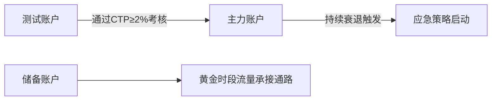

# Facebook广告智能优化策略全案手册 

---

## 一、动态账户结构体系

### 1.1 账户分级管理方案


### 1.2 核心调控规则
| 异常事件        | 触发条件              | 自动响应机制            |
|----------------|-----------------------|-----------------------|
| CPM突发性暴涨   | 3小时涨幅>45%         | 0点转时段重启          |
| CTR连续式崩盘   | 8小时内降幅>25%       | 调取备素材TOP3         |
| ROAS长期低迷    | 5天均值<1.3           | 重组受众定向网         |

---

## 二、创意熔断体系

### 2.1 全要素测试工场
**四维度创新矩阵**
- 视频：悬念开场 (首帧倒计时)+场景构建+实时数据标签
- 轮播：用户证言三部曲 (使用前/中/后)+质检报告可视化
- 图文：痛点对比矩阵+价格阶梯表+限时抢购浮层
- 互动：动态选择器+实时库存警示+双屏投票体系

### 2.2 素材衰退预警
```processing
当检测到以下信号时：
1. 同类素材曝光次数>5万次
2. 时段CTR下降梯度>15%/小时
3. 互动成本突破$5警戒线

执行：
→ 启用「创意抢救」模型 
→ 拆解元素重组新组合
→ 降级至低权重版位观测
```

---

## 三、智能受众培育网络

### 3.1 七阶用户培育模型
| 用户特征        | 行为标记              | 培育动作                |
|----------------|-----------------------|-----------------------|
| 闪退客          | 首屏停留<5秒          | 强冲击痛点素材          |
| 轻度浏览        | 访问3-5页             | 场景解决方案推送        |
| 深度研究        | 参数页停留>120秒      | 专家测评+方案对比       |
| 反复犹豫        | 多次访问同商品        | 动态优惠梯度            |
| 休眠流失        | 15天无互动            | 唤醒礼包+新功能剧透     |
| 精准复购        | 月均消费≥3次          | VIP特权体系搭建         |
| 品牌大使        | 推荐转化≥5人          | 裂变奖励机制            |

### 3.2 再营销技术矩阵
**高级数据追踪配置**
```bash
# 核心事件埋点
ViewContent → 跨设备访问轨迹
AddToCart → 购物车价值分级
Purchase → LTV预测模型

# 智能培育策略
购物车放弃 → 2h后触发客服外呼
参数页高频点击 → 实时推送技术文档
复购窗口期 → 提前3天邮件+Push组合拳
```

---

## 四、数据中枢决策系统

### 4.1 健康度监测模型
| 核心维度        | 警戒阈值          | 优化方案                |
|----------------|-------------------|-----------------------|
| 频率超标        | >3次/周           | 清洗过期受众池          |
| 素材同质化      | >65%重复度        | 启动模块化换装          |
| 时段衰减        | 波动值>40%        | 智能分时预算调节        |
| 兴趣衰减        | 匹配度<60%        | 动态补充兴趣词库        |

### 4.2 智能调控引擎
```python
def optimization_engine():
    if 黄金时段转化率激增:
        自动追加45%预算池
        上调出价12-15%
    elif 凌晨时段CPM走低:
        切换至Messenger版位
        开启实验性素材投放
    else:
        维持现有策略组合
```

---

## 五、长效运营架构

### 5.1 素材全周期管理
| 阶段   | 关键指标            | 管理规则              |
|--------|---------------------|---------------------|
| 导入期 | 5组AB测试          | 72小时筛选期          |
| 成长期 | CTR≥2.5%           | 预算梯次放开          |
| 成熟期 | ROI≥2.0            | 全版位覆盖策略        |
| 衰退期 | 单日衰减率≥8%      | 拆解元素重组计划      |

### 5.2 团队协作规范
**四大核心准则**
- 素材命名：日期_产品线_介质类型_版本（例：0520_3C_视频_V7）
- 数据追踪：每2小时生成动态数据简报
- 危机响应：30分钟黄金响应窗口期（红/橙/黄三级）
- 知识沉淀：每周更新策略案例知识库
  [教学视频](https://youtube.com/shorts/29uS1Jx5LEY?feature=share)
```
